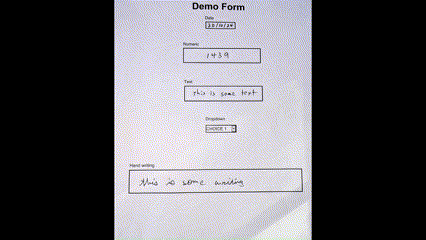

# ✨ Snowflake Document AI Magic Demo ✨

This is a quick and fun proof of concept demo developed to show off the capabilities of Snowflake Document AI. The idea of the "magic" is to have an audience member fill out the paper form and then you as the "magician" will snap a picture of the form and it will magically appear on the streamlit app on the screen without you having to touch your computer. Top hat and cape are optional by highly recommended for effect.


<p align="center">
  
</p>

## Requirements
- Snowflake
    - account
    - access to Document AI
    - access to Streamlit in Snowflake
    - internal stage
    - ability to create a table
- A computer to run python file watcher
- Microsoft teams / OneDrive and or Google Drive (A way to email a file to a folder on the computer running the file watcher script)

## Step by step walk through

### 1. Setup snowflake objects - stage & table

Create a stage where form images can be sent and a table to store the processed data.

```SQL
CREATE stage doc_ai_magic_stage
```

```SQL
CREATE OR REPLACE TABLE MY_DB.MY_SCHEMA.DOCFORM_TABLE (
	SCORE FLOAT,
	DATE_VALUE VARCHAR,
	TEXT_VALUE VARCHAR,
	DROPDOWN_VALUE VARCHAR,
    NUMERIC_VALUE VARCHAR,
	FREE_TEXT_WRITING_VALUE VARCHAR
)
```

*Replace `MY_DB` and `MY_SCHEMA` with your database and schema.

### 2. Deploy and train new Document AI Model

#### 2.1 Deploy Model

Deploy a Document AI model from Snowsight UI.

#### 2.2 Make Training Data

Print off 20 copies of the `./resources/demo_form_empty.pdf file` and have various people fill it out. All fields can be filled out by hand (the dropdown field can be preselected; it is used to show the option of having a preselected field in a form). Ideally the forms should use printing for all fields except the handwriting field which should use cursive. 

#### 2.3 Train Document AI Model

Upload the training files to the model and train it.

### 3. Deploy Streamlit App in Snowflake

Copy code from `01_magic_streamlit_app.py` into a a Streamlit in Snowflake app.

### 4. Setup Local folder

Setup a local folder to watch for form files.
 
### 5. Setup Python script

1. Copy `02_magic_file_watcher.py` to a local folder and setup virtual environment `python -m venv .venv`, `pip install -r requirements.txt'`.
2. Add the connection parameters to the script along with the WATCH_DIR, STAGE, TABLE_NAME, MODEL_NAME, MODEL_VERSION and FILE_TYPE.

### 6. Start the Show

1. Start the file watcher script.
2. Start the Streamlit app and make it full screen.

### 6. Watch the Magic Happen

1. Get someone to fill out the document, snap a picture and upload it to the watched folder using only your phone.
2. Watch as they are amazed that their writing appears on the screen like "MAGIC" ✨.